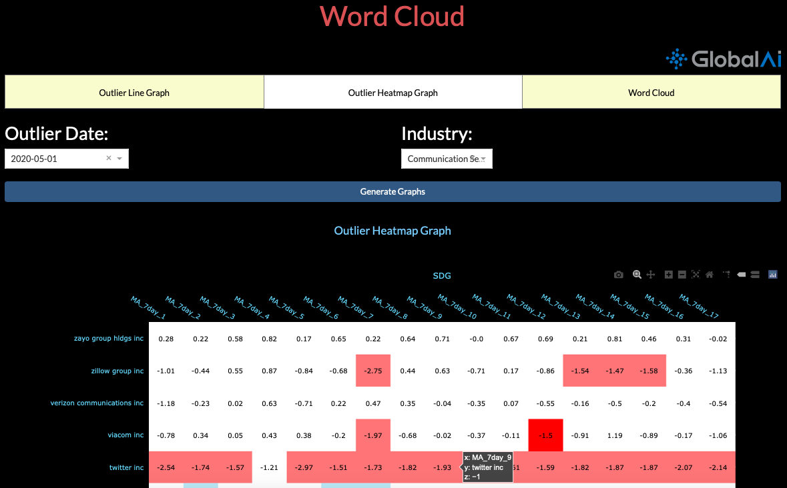

[](https://www.globalai.co)

-------

# SDG Outliers Word Clouds

# Contents
- [Raw data](#data)
- [Methods do identify outliers](#method)
    - [Method I](#method1)
    - [Method II](#method2)
    - [Method III: what we use right now](#method3)
        - [Threshold table](#thresh)
        - [Code](#code)
- [Rank the outliers](#rank)
- [Visualization](#visual)
    - [Heatmap](#heatmap)
        - [Matplotlib](#matplotlib)
        - [Plotly](#plotly)
    - [Word Cloud](#wordcloud)
        - [Packages](#package)
        - [Stopwords and check English](#check)
        - [Text clean](#clean)
        - [Word Cloud Functions](#wordcloudf)
    - [Heroku apps](#heroku)
- [Next steps](#next)
- [Reference and previous work](#reference)
        
----


# Raw data <a id="data"> </a>
### Source
| Type |Version|Link|
|------|-------|----|
|SDG(MSCI US)| Ratings |https://www.dropbox.com/s/fcpt5lejcf60n2e/SDG_Data_File_Daily.csv?dl=0|
||Adjusted Ratings|https://www.dropbox.com/s/arspmclsjrkj00q/SDG_Adjusted_File_Daily.csv?dl=0|
||URLs|https://www.dropbox.com/s/ro7ucgccrf73u9o/Daily_v1v2_MXUS_URL.pkl?dl=0|
|Sentiment|Ratings|https://www.dropbox.com/s/dyvqrt8g22y8vk9/Sentiment_Data_File_Daily.csv?dl=0|
|(MSCI US)|URLs|Pending|
|ESG|Ratings|https://www.dropbox.com/s/0ta8tx9rkk4jt2s/ESG_Data_File_Daily.csv?dl=0|

### Description of some features
|Freature   |Description   | Source          |
|-----------|--------------|-----------------|
|GICS Sector|Each company can be classified into 1 of 11 GICS sectors and this column contains that information. We use this to generate sector-wise attributions||
|SDG_1~17|Daily scores of companies based on how they impact each sustainable development goal. Represents the average tone from all the articles about the company relating to one Sustainable Development Goal. Is set to ‘NaN’ for days with no news. (Possible range-[-100, 100], 99% range~[-6, 6])||
|SDG_Mean|Average score based on all SDGs. (Range ~ [-6, 6])
|SDG_1~17_std|The standard deviation of the scores by various articles per day. For instance, if ‘Apple Inc’ has 10 articles mentioning SDG_1, SDG_1_STD for ‘Apple Inc’ for that day will represent the variation between the articles||
|SDG_1~17_count|The number of corresponding news||
|SDG_1~17_url|A list of corresponding news||
|MA_7day_1~17|7-day Moving Average <br> Documentation: [Attribution.docx](prev_docu/Attribution.docx)|[Check the calculation methods](MA_calculation)|
|MA_60day_1~17|60-day Moving Average <br> Documentation: [Attribution.docx](prev_docu/Attribution.docx)|[Check the calculation methods](MA_calculation)|

# Methods do identify outliers <a id="method"> </a>
Check out the previous documention: [Fiona_outliers.docx](prev_docu/Fiona_outliers.docx), if you want to know more details about these three methods.

### Method 1: absolute value <a id="method1"></a>
- If the absolute value is larger than some level (a number we set, in some part we call it scale), then we say it is an outlier.
### Method 2: absolute daily changes <a id="method2"></a>
- If the absolute value of daily change is larger than some number (we call it change), we say it is an outlier.
### Method 3: Combine Method 1(absolute STS) and Method 2 (absolute daily change in STS) <a id="method3"></a>
We say a score is an outlier, if:
- The absolute value should be larger than the level
- The absolute value of daily change is larger than the change we set
- The counts of corresponding news in more than the medium
- The standard deviation is less than the medium (we don't consider the records with high std)

**Threshold** <a id="thresh"></a>

After the grid search by Fiona ([Fiona_outliers.docx](prev_docu/Fiona_outliers.docx)), we decided to use the following thresholds. 
- Once a day means, on average, SDG_mean has only one outlier each day
- Once a week means, on average, SDG_mean has only one outlier each week.
- Once a month means, on average, SDG_mean has only one outlier each month.

|Frequency   | count_quantile|std_quantile|level|change|
|:----------:|:-------------:|:----------:|:---:|:----:|
|Once a day  | 0.5           |0.5         |1.3  |0.8   |
|Once a week | 0.5           |0.5         |2.3  |1.15  |
|Once a month| 0.5           |0.5         |2.2  |1.75  |

I used a sample (from Jan 2020 to May 2020) to transfer the count and std quantile to exact numbers and save as [thresh.csv](data/thresh.csv). 
- This table is helpful for the plotly app, so that we don't need to upload all data and can calculate the thresholds in advance.
- This table should be updated frequently.

(Data source: https://www.dropbox.com/s/5puf0x5za60d921/urls_2020.csv?dl=0)

Code to generate thresh table.
```python
# read data from data souce mentioned above
df_rated = pd.read_csv('urls_2020.csv')

# calculate daily difference
df_diff = df_rated[['MA_7day_1', 'MA_7day_2', 'MA_7day_3', 'MA_7day_4', 'MA_7day_5', 'MA_7day_6', 'MA_7day_7', 'MA_7day_8', 'MA_7day_9', 'MA_7day_10', 'MA_7day_11', 'MA_7day_12', 'MA_7day_13', 'MA_7day_14', 'MA_7day_15', 'MA_7day_16', 'MA_7day_17', 'MA_7day_Mean']].diff()
columns_lst = ['diff_'+str(i) for i in range(1,18)]
columns_lst.append('diff_Mean')
df_diff.columns = columns_lst
df_merge = pd.concat([df_rated,df_diff],axis=1)
first = min(df_merge['date'])
indexer = df_merge[df_merge['date']== first].index
df_merge.loc[indexer, columns_lst]= float("NAN")

# create a thresh table
col = ["freq", "count", "std", "level", "change"]
for i in range(1,18):
    col.append('SDG_'+str(i)+'_count')
    col.append('SDG_'+str(i)+'_std')
thresh = pd.DataFrame(columns=col)
day = {"freq":"day", "count":0.5, "std":0.5, "level":1.3, "change":0.8}
week = {"freq":"week", "count":0.5, "std":0.5, "level":2.3, "change":1.15}
month = {"freq":"month", "count":0.5, "std":0.5, "level":2.20, "change":1.75}
thresh = thresh.append(day, ignore_index=True)
thresh = thresh.append(week, ignore_index=True)
thresh = thresh.append(month, ignore_index=True)

# populate counts and std
for i in range(3):
    for sdg in range(1,18):
        thresh['SDG_'+str(sdg)+'_count'] = df_merge['SDG_'+str(sdg)+'_count'].quantile([thresh['count'][i]]).values[0]
        thresh['SDG_'+str(sdg)+'_std'] = df_merge['SDG_'+str(sdg)+'_std'].quantile([thresh['std'][i]]).values[0]
```

**Outlier Code** <a id="code"></a>

1. Load packages and data
- Here I used a company's (Boohoo) data: [Ratings_Boohoo.csv](data/Ratings_Boohoo.csv) as an example
- Also, a threshold table: [thresh.csv](data/thresh.csv) mentioned above

```python
import pandas as pd
# Read data
df = pd.read_csv('Ratings_Boohoo.csv')
thresh = pd.read_csv('thresh.csv')
```


2. Add columns which can show the daily difference, by using the  ```.diff()```function, and get a new dataset ```df_merge```
```python
df_diff = df[['MA_7day_1', 'MA_7day_2', 'MA_7day_3', 'MA_7day_4', 'MA_7day_5', 'MA_7day_6', 'MA_7day_7', 'MA_7day_8', 'MA_7day_9', 'MA_7day_10', 'MA_7day_11', 'MA_7day_12', 'MA_7day_13', 'MA_7day_14', 'MA_7day_15', 'MA_7day_16', 'MA_7day_17', 'MA_7day_Mean']].diff()
columns_lst = ['diff_'+str(i) for i in range(1,18)]
columns_lst.append('diff_Mean')
df_diff.columns = columns_lst
df_merge = pd.concat([df,df_diff],axis=1)
first = min(df_merge['date'])
indexer = df_merge[df_merge['date']== first].index
df_merge.loc[indexer, columns_lst]= float("NAN")
```

3. Two functions to identify outliers
- ```level()```: a function to examine if a score is an outlier
    - Used inside the ```heatmapf()```
    - **0** means it's not an outlier
    - **1** means a **slightly postive** outlier, **2** means an **extremely positively** outlier
    - **-1** means a **slightly negative** outlier, **-2** means an **extremely negative** outlier
- ```heatmapf()```: a function can generate two tables, ```score``` and ```color```
    - parameters: 
        - ```df```: the sample dataset
        - ```thresh```: threshold table, inculdes thresholds for daily, weekly, and monthly frequency
        - ```freq```: three levels - 'day', 'week', 'month'
    - ```score```: a table shows the exact SDG scores (two decimals), '-' means missing value
    - ```color```: a table shows the outlier levels ranges from -2 to 2
```python
def level(thresh, MA, DIFF,count_, std_, sdg, freq):
    if freq == "day":
        ind=0
    elif freq == "week":
        ind=1
    else:
        ind=2
    scale=thresh['level'][ind] 
    count=thresh['count'][ind]
    std=thresh['std'][ind]
    diff=thresh['change'][ind]
    count2 = thresh['SDG_'+str(sdg)+'_count'][ind]
    std2 = thresh['SDG_'+str(sdg)+'_std'][ind]
    if (abs(MA) < scale) or (abs(DIFF) < diff):
        return 0
    if MA>0:
        if count_ >= count2 and std_ <= std2:
            return 2
        else:
            return 1
    elif MA < 0:
        if count_ >= count2 and std_ <= std2:
            return -2
        else:
            return -1
    else: return 0

def heatmapf(df, thresh, freq='day'):
    col = ["date"] # need to change a little bit, if the sample is for all companies
    for sdg in range(1,18):
        col.append('MA_7day_'+str(sdg))
    df = df.reset_index(drop=True)
    score =  df[col]
    # generate a color label table
    color = pd.DataFrame(columns=col)
    color['date']=score['date']
    """
    Outlier parameter
    """
    for sdg in range(1,18):    
        for i in range(len(df)):
            MA = df['MA_7day_'+str(sdg)][i]
            DIFF = df['diff_'+str(sdg)][i]
            count_ = df['SDG_' + str(sdg) + '_count'][i]
            std_ = df['SDG_' + str(sdg) + '_std'][i]
            color['MA_7day_'+str(sdg)][i] = level(thresh, MA, DIFF, count_, std_, sdg, freq)
    # replace nan with '-'
    for c in col[1:]:    
        for i in range(len(score)):
            if abs(score[c][i]) <= 100:
                score[c][i] = round(score[c][i],2)
            else: score[c][i] = '-'
    return color, score
```
4. Example

- **Code**

```python
sample = df_merge[df_merge['date']>='2020-06-01']
sample = sample.sort_values(by='date', ascending=False)
sample = sample.reset_index(drop=True)
color, score = heatmapf(sample,thresh,freq='day')
```
- **Output**


# Rank the outliers <a id="rank"></a>
There are two ways to rank the selected outliers, by change or by level, return the first 10 records. (modify the last line ```return df.head(10)``` in the function, if you want to show more records)
- ```df```: sample dataframe
- ```thresh```: threshold table
- ```sdg```: range from 1 to 17
- ```freq```: three levels - 'day', 'week', 'month'
- ```date```: you can choose a specific date, and can also can set it as 'all' to take all dates under consideration
- ```rank```: by 'level' or by 'change'
- ```PorN```: only rank 'positive' outliers, or 'negative' outliers, or 'all' outliers.

```python
def rank_by_frequency(df, thresh, sdg=1, freq='day',date='all',rank='level', PorN='positive'):
    if freq == 'day':
        ind = 0
    elif freq == 'week':
        ind = 1
    elif freq == 'month':
        ind = 2
    else: return "Please select freq among ['day', 'week', 'month']"

    ind = 0
    level = thresh['level'][ind]
    change = thresh['change'][ind]
    count = thresh['SDG_'+str(sdg)+'_count'][ind]
    std = thresh['SDG_'+str(sdg)+'_std'][ind]

    if date == 'all':
        pass
    else:
        df = df[df['date']==date]
        df = df.reset_index(drop=True)

    if PorN == 'positive':
        df = df[(df['MA_7day_'+str(sdg)]>level) &  (abs(df['diff_'+str(sdg)]) > change) & (df['SDG_'+str(sdg)+'_count']>count) & (df['SDG_'+str(sdg)+'_std']<std)]
    elif PorN == 'all':
        df = df[(abs(df['MA_7day_'+str(sdg)])>level) &  (abs(df['diff_'+str(sdg)]) > change) & (df['SDG_'+str(sdg)+'_count']>count) & (df['SDG_'+str(sdg)+'_std']<std)]
    elif PorN == 'negative':
        df = df[(-(df['MA_7day_'+str(sdg)])>level) &  (abs(df['diff_'+str(sdg)]) > change) & (df['SDG_'+str(sdg)+'_count']>count) & (df['SDG_'+str(sdg)+'_std']<std)]
    else: return "Please select PorN among ['all', 'positive', 'negative']"
    col = ['date', 'COMPANY', 'GICS Sector', 'SDG_'+str(sdg), 'MA_7day_'+str(sdg), 'diff_'+str(sdg), 'SDG_'+str(sdg)+'_count', 'SDG_'+str(sdg)+'_std', 'SDG_'+str(sdg)+'_url']
    df = df[col]
    df = df.reset_index(drop=True)

    if rank == 'level':
        df = df.iloc[(-df['diff_'+str(sdg)].abs()).argsort()]
        df = df.reset_index(drop=True)
        df = df.iloc[(-df['MA_7day_'+str(sdg)].abs()).argsort()]
        df = df.reset_index(drop=True)
    elif rank == 'change':
        df = df.iloc[(-df['MA_7day_'+str(sdg)].abs()).argsort()]
        df = df.reset_index(drop=True)
        df = df.iloc[(-df['diff_'+str(sdg)].abs()).argsort()]
        df = df.reset_index(drop=True)
    else:
        return "Please select rank among ['level', 'change']"

    return df.head(10)
```
**Example and output**
```python
rank_by_frequency(df=df_merge, thresh=thresh, sdg=1, freq='month', date='all',rank='level', PorN='all')
```


# Visualization <a id="visual"></a>
The visualization section inculdes instruction for the heatmap and word clouds.

## Heatmap <a id="heatmap"></a>

Here are two versions.
- One is for some casual checking, using Matplotlib
- The other one is for the dash app, using Plotly

### A normal heatmap <a id="matplotlib"></a>
```python
import matplotlib
import matplotlib.pyplot as plt
import numpy as np

heat_data = color.iloc[:,1:].to_numpy() # use the color table to show the outlier level
heat_data = heat_data.astype(np.int32)
label = score.iloc[:,1:].to_numpy() # use the score table to show the score
label = label.astype(np.str)

plt.figure(figsize=(20,32))
data = heat_data
labels = label
xtick = list(color.columns)[1:]
ytick = list(color['date'])
cmap = matplotlib.colors.ListedColormap(['red','lightsalmon','lemonchiffon'])
heatmap = plt.pcolor(data, cmap=cmap)

for y in range(data.shape[0]):
    for x in range(data.shape[1]):
        plt.text(x+0.5, y+0.5, labels[y][x],
                 horizontalalignment='center',
                 verticalalignment='center', fontsize=16)

# plt.colorbar(heatmap)
plt.xticks(np.arange(0.5,17.5,1), xtick, rotation=20, fontsize = 16)
plt.yticks(np.arange(0.5,88.5,1), ytick, fontsize = 16)
plt.title("Boohoo daily outlier", fontsize=28)
plt.show()
```
<center> 

</center>

### Plotly Heatmap <a id="plotly"></a>
The dash app has already been set up. So, for the future steps, you can **skip the first step and go to the download and modification steps directly, if it is not your first time to push heroku app.**

This is a dash app with option to select date and industry, but currently the app is only applicable for **May 2020**.



**Current data source for dash app**

```python
"""
Currently, we only visualized data in May 2020
Data Source: https://www.dropbox.com/s/5puf0x5za60d921/urls_2020.csv?dl=0
"""
import pandas as pd

df_rated = pd.read_csv('urls_2020.csv')
df_rated = df_rated[df_rated['date']>='2020-05-01']
df_rated.to_pickle('df_rated1.pkl')
```

**Check out the following file and steps:**
1. Tutorial to set up the app by Stanley, including setting up virtual environment, Heroku, and installing relevant packages: [deploy_app_to_heroku.pdf](prev_docu/deploy_app_to_heroku.pdf)
2. Download previous work. (You need to ask for the password of Heroku account)
```
\\ go to your terminal

\\ install virtual environment
$ python3 -m pip install --user virtualenv
$ cd /SetPath 
$ python3 -m virtualenv venv

\\ activate,skip last step if you already have installed virtualenv
$ source venv/bin/activate  \\ Mac OS
$ .\venv\Scripts\activate   \\ Windows

\\ check out deploy_app_to_heroku.pdf to set up heroku, and log in
$ heroku login

\\ log in as richard.v.rothenberg@gmail.com

\\ download
$ git clone https://git.heroku.com/gai-wordcloud-app.git
```
3.  Modify and push

After downloading the files, you can do any modification you want. 

Then push to heroku
```
\\ go to the folder you cloned and check your changes
$ cd gai-wordcloud-app
$ git staus 
\\ add file to local and push remotely
$ git add .
$ git commit -m 'add some comments'
$ git push
```
Wait a few moments for the push


```
\\ open the app and get your link, sometimes need to wait for 1 minite
$ heroku open

\\ https://gai-wordcloud-app.herokuapp.com

\\ deactivate virtual python
$ deactivate
```


4. **(Important)** If you are not sure that your mofication will work properly, push to a new **remote branch**
5. **(Material)** Learn more about [git](https://github.com/pcottle/learnGitBranching), and exercise [here](https://learngitbranching.js.org/?locale=en_US)

## Word Cloud <a id="wordcloud"></a>
In order to create a word cloud as follow, do the following steps.


### Packages Required <a id="package"> </a>

```python
import ast
import math
import datetime
import pandas as pd
import matplotlib.pyplot as plt
import seaborn as sns
import itertools
import sys
import re
from nltk.tokenize import word_tokenize
from nltk.corpus import stopwords
from nltk.corpus import words
import string
from collections import Counter
from wordcloud import WordCloud
import spacy
import multiprocessing
import nltk
from nltk.corpus import stopwords
nltk.download('punkt')
nltk.download('stopwords')
nltk.download('words')
```
### Set the stop words and exglish words <a id="check"></a>
- Stop words will be automatically excluded from word cloud. 
- set_of_words will be used to check if a word is English
- Please use the data structure **set**, which can make the running time less than the list structure.

```python
stop_words = set(stopwords.words('english'))
stop_words.add('html')
stop_words.add('.html')
stop_words.add('www')
stop_words.add('http')
stop_words.add('au')
stop_words.add('com')
stop_words.add('https')
stop_words.add('htm')
stop_words.add('php')
stop_words.add('spip')
stop_words.add('id')
stop_words.add('sid')
stop_words.add('cms')
stop_words.add('xhtml') 
stop_words.add('storyid')
stop_words.add('new')
stop_words.add('news')
stop_words.add('whats')
stop_words.add('people')
stop_words.add('put')

set_of_words = set(words.words())
```
### Text Cleaning Function <a id="clean"></a>

```python
def clean_text(url_list):
    set_of_words = set(words.words())
    stop_words = set(stopwords.words('english')+stopwords.words('spanish'))
    stop_words.add('html')
    stop_words.add('.html')
    stop_words.add('www')
    stop_words.add('http')
    stop_words.add('au')
    stop_words.add('com')
    stop_words.add('https')
    stop_words.add('htm')
    stop_words.add('php')
    stop_words.add('spip')
    stop_words.add('id')
    stop_words.add('sid')
    stop_words.add('cms')
    stop_words.add('xhtml') 
    stop_words.add('storyid')
    stop_words.add('new')
    stop_words.add('news')
    stop_words.add('whats')
    stop_words.add('people')
    stop_words.add('put')

    token = []
    for i in url_list:
        try:       
            result = re.match('.*?//.*?/(.*?)\'.*?',i)
            match = re.findall('\w\w+',result.group(1))
            token += match
        except: pass
    token = [w.lower() for w in token]
    token = [w for w in token if w in set_of_words]
    token = [w for w in token if not w in stop_words]
    return token
```
### Word Cloud Function <a id="wordcloudf"></a>
The function used in plotly dashboard. if the corresponding url cell is empty, then the word cloud will return **"Not Available"**.


```python
def return_wordcloud(df, company, date, sdg):
    urls = []
    try:
        sample = df[(df['COMPANY']==company)&(df['date']==date)]
        url = list(sample['SDG_'+str(sdg)+'_url'])[0][2:-1].split(', ')
        urls += url
    except: pass
    
    word = clean_text(urls)
    if len(word) == 0:
        word = ['Not Available']

    cout_words = Counter(word)
    wordcloud = WordCloud(max_words =70,max_font_size=200, width=1000, height=500)
    wordcloud.generate_from_frequencies(frequencies = cout_words)
    plt.figure(figsize=(20,10) )
    plt.imshow(wordcloud, interpolation="bilinear")
    plt.gca().set_axis_off()
    plt.subplots_adjust(top = 1, bottom = 0, right = 1, left = 0,
                hspace = 0, wspace = 0)
    plt.margins(0,0)
    plt.gca().xaxis.set_major_locator(plt.NullLocator())
    plt.gca().yaxis.set_major_locator(plt.NullLocator())
    plt.savefig("word_cloud_image.png", bbox_inches = 'tight',
        pad_inches = 0)
    del sample
    del urls
    del word
    del wordcloud
```
For daily check, you can add more lines to customize title or choose to save the figure.


```python
cout_words = Counter(word)
wordcloud = WordCloud(max_words =70,max_font_size=200, width=1000, height=500)
wordcloud.generate_from_frequencies(frequencies = cout_words)  
plt.figure(figsize=(20,10) )
plt.imshow(wordcloud, interpolation="bilinear")
plt.title(date[i]+'/'+sdg+'/'+'Rank: '+str(i+1) + '/'+ co[i], {'fontsize': 18, 'color':'darkred', 'weight':'bold'})
plt.savefig(sdg+'-'+'Rank:'+str(i+1) +'.png')
```

## Heroku apps <a id="heroku"> </a>

Check the documentation here: [Link](heroku.md)

This documentation includes contents for two heroku dash apps.


# Next Steps <a id="next"></a>

> Pending
> - Task 1
> - Task 2
> - ...


# Previous work and reference <a id="reference"></a>

[1] Moving Average Calculation: [documentation](prev_docu/attribution.docx) and [code](MA_calculation). **Sanchit**.

[2] Outlier method and grid search for threshold: [documentation](prev_docu/Fiona_outliers.docx) (code is inside the documentation). **Fiona**

[3] Plotly and heroku tutorial: [PYTHON_DASHBOARDS_heroko.pdf](prev_docu/PYTHON_DASHBOARDS_heroko.pdf)

[4] [Deployment app to heroku](prev_docu/deploy_app_to_heroku.pdf). **Stanley**

[5] Learn more about git: [link](https://learngitbranching.js.org/?locale=en_US)


<br>

<br>

<br>

-----

If you have any question about this documentation, e-mail to the following address:

**Jane zl2772@columbia.edu**