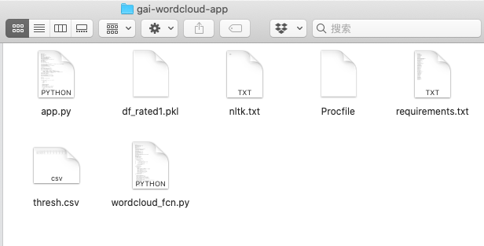
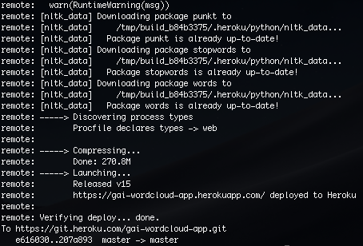

[](https://www.globalai.co)

-------

# Heroku Apps

# Contents

- [Set up and Update](#setup)

- [App 1: Outlier](#app1)
    - Line Graph
    - Heat Map
    - Word Cloud
- [Reference](#reference)

----

# Set up and Update <a id="setup"></a>

1. Tutorial to set up the app by Stanley, including setting up virtual environment, Heroku, and installing relevant packages: [deploy_app_to_heroku.pdf](prev_docu/deploy_app_to_heroku.pdf)
2. Download previous work. (You need to ask for the password of Heroku account)
```
\\ go to your terminal

\\ install virtual environment
$ python3 -m pip install --user virtualenv
$ cd /SetPath 
$ python3 -m virtualenv venv

\\ activate,skip last step if you already have installed virtualenv
$ source venv/bin/activate  \\ Mac OS
$ .\venv\Scripts\activate   \\ Windows

\\ check out deploy_app_to_heroku.pdf to set up heroku, and log in
$ heroku login

\\ log in as richard.v.rothenberg@gmail.com

\\ download
$ git clone https://git.heroku.com/gai-wordcloud-app.git
```
3.  Modify and push

After downloading the files, you can do any modification you want. 

Then push to heroku
```
\\ go to the folder you cloned and check your changes
$ cd gai-wordcloud-app
$ git staus 
\\ add file to local and push remotely
$ git add .
$ git commit -m 'add some comments'
$ git push
```
Wait a few moments for the push



```
\\ open the app and get your link, sometimes need to wait for 1 minite
$ heroku open

\\ https://gai-wordcloud-app.herokuapp.com

\\ deactivate virtual python
$ deactivate
```


4. **(Important)** If you are not sure that your mofication will work properly, push to a new **remote branch**
5. **(Material)** Learn more about [git](https://github.com/pcottle/learnGitBranching), and exercise [here](https://learngitbranching.js.org/?locale=en_US)


# App 1: Outlier <a id="app1"></a>

This app has three tabs:

- **A line graph**: outlier time series, include line graph with T+/-10 (10 days before, and 10 days after the outlier event)
- **A heatmap**: EVERY DAY there will be a heatmap of 17 SDGs X N companies (600+); and if no outlier defined, then cell is white. If 1rst threshold then color is a bit red; and if 2nd threshold hit, then color is more red, and so on
- **WordCloud and Tables**: WordCloud and URLS, there is no ranking of relevance yet. For now just show the first 20 or 30 URLS

Some resources:
- Check the code: [folder](code/heroku_app)
- Heroku repo: https://git.heroku.com/gai-wordcloud-app.git
- Check the Dashboard Link: https://gai-wordcloud-app.herokuapp.com

## Line Graph

- Get the line graph data

```python
# line graph data
def return_line_graph_data(df,company, date):
    dateList = []
    for i in range(-10,11):
        dateList.append(str(datetime.datetime.strptime(date,'%Y-%m-%d') + datetime.timedelta(days=i))[:10])
    col = col = [dateList[x]+'(T'+str(x-10)+')' for x in range(0,21)]
    col = ['sdg' ]+col
    result = pd.DataFrame(columns=col)
    df = df[(df['COMPANY']==company)]

    for sdg in range(1,18):
        row = []
        for element in dateList:
            try:
                sample = df[df['date']==element]
                row.append(list(sample['SDG_'+str(sdg)])[0])   # modified row
            except:
                row.append(None)
        row = ['SDG'+str(sdg)]+row
        new_row = {}
        for i in range(len(row)):
            new_row[col[i]] = row[i]
        result = result.append(new_row,ignore_index=True)
    return result
```

- Plot
```python
def updatefunction1(n_clicks, label, date):
    date = date[0:10]
    res = return_line_graph_data(df_merge[thecolumns],company = label, date=date)
    sdg_data = res.iloc[:,1:]

    length = len(sdg_data)
    trace=[]
    for i in range(length):
        trace.append(
                go.Scatter(
                    x=sdg_data.columns.tolist(),
                    y=sdg_data.loc[sdg_data.index[i]].tolist(),
                    mode="lines",
                    name=res.sdg.tolist()[i]))
    timeseries = go.Figure(
                        data=trace,
                        layout={'title': {'text': f"{label} SDG line plot<br>{date}",
                                          'xanchor': 'center', 'x': 0.5},
                                'xaxis': {'title': 'Date'},
                                'yaxis': {'title': 'SDG'},
                                'paper_bgcolor': "Black",
                                'plot_bgcolor': 'Black',
                                'font': {'color': '#7FDBFF'}})

    return timeseries
```

## Heat Map

- Get the data

```python
# heatmap data
df_rated = pd.read_pickle('df_rated1.pkl')
thresh= pd.read_csv('thresh.csv')
outl_d = sorted(list(set(df_rated['date'])))
ind_lst = list(set(df_rated['GICS Sector']))

df_diff = df_rated[['MA_7day_1', 'MA_7day_2', 'MA_7day_3',
       'MA_7day_4', 'MA_7day_5', 'MA_7day_6', 'MA_7day_7', 'MA_7day_8',
       'MA_7day_9', 'MA_7day_10', 'MA_7day_11', 'MA_7day_12', 'MA_7day_13',
       'MA_7day_14', 'MA_7day_15', 'MA_7day_16', 'MA_7day_17', 'MA_7day_Mean']].diff()
columns_lst = ['diff_'+str(i) for i in range(1,18)]
columns_lst.append('diff_Mean')
df_diff.columns = columns_lst

df_merge = pd.concat([df_rated,df_diff],axis=1)
first = min(df_merge['date'])
indexer = df_merge[df_merge['date']== first].index
df_merge.loc[indexer, columns_lst]= float("NAN")
del df_diff
thecolumns = list(df_rated.columns)
del df_rated


def level(thresh, MA, DIFF,count_, std_, sdg, freq):
    if freq == "day":
        ind=0
    elif freq == "week":
        ind=1
    else:
        ind=2

    scale=thresh['level'][ind]
    count=thresh['count'][ind]
    std=thresh['std'][ind]
    diff=thresh['change'][ind]
    count2 = thresh['SDG_'+str(sdg)+'_count'][ind]
    std2 = thresh['SDG_'+str(sdg)+'_std'][ind]

    if (abs(MA) < scale) or (abs(DIFF) < diff):
        return 0
    if MA>0:
        if count_ >= count2 and std_ <= std2:
            return 2
        else:
            return 1
    elif MA < 0:
        if count_ >= count2 and std_ <= std2:
            return -2
        else:
            return -1
    else: return 0


def heatmapf(day, industry, thresh, freq='day'):
    col = ["COMPANY"]
    for sdg in range(1,18):
        col.append('MA_7day_'+str(sdg))
    df = df_merge[(df_merge['GICS Sector']==industry) & (df_merge['date']==day)].reset_index(drop=True)
    score =  df[col]
    # generate a color label table
    color = pd.DataFrame(columns=col)
    color['COMPANY']=score['COMPANY']
    """
    Outlier parameter
    """
    for sdg in range(1,18):
        for i in range(len(df)):
            MA = df['MA_7day_'+str(sdg)][i]
            DIFF = df['diff_'+str(sdg)][i]
            count_ = df['SDG_' + str(sdg) + '_count'][i]
            std_ = df['SDG_' + str(sdg) + '_std'][i]
            color['MA_7day_'+str(sdg)][i] = level(thresh, MA, DIFF, count_, std_, sdg, freq)
    # replace nan with '-'
    for c in col[1:]:
        for i in range(len(score)):
            if abs(score[c][i]) <= 100:
                score[c][i] = round(score[c][i],2)
            else: score[c][i] = '-'
    del df
    return color, score

```

- Plot 

```python
def updatefunction2(n_clicks, label, label1):

    color, score = heatmapf(day=label,industry=label1,thresh=thresh)

    x = list(color.columns[1:])
    y = list(color['COMPANY'])
    z = color.iloc[:,1:].values
    z_text = score.iloc[:,1:].values
    white_p = 0 - np.min(z) / (np.max(z) - np.min(z))
    colorscale = [[0, 'red'], [white_p, 'white'], [1, 'skyblue']]
    font_colors = ['black', 'black']
    heatmap = ff.create_annotated_heatmap(z, x=x, y=y,annotation_text=z_text,colorscale=colorscale, font_colors=font_colors)

    heatmap.update_layout(
                       xaxis={'title':'SDG'},
                       yaxis={'title': 'Company'},
                       paper_bgcolor="Black",
                       plot_bgcolor="Black",
                       font={"color": "#7FDBFF"})
    return heatmap
```
## Word Cloud

- Get data

```python
import re
import pandas as pd
import matplotlib.pyplot as plt
import seaborn as sns
import itertools
import sys
import pandas as pd
import re
from nltk.tokenize import word_tokenize
from nltk.corpus import stopwords
from nltk.corpus import words
import string
from collections import Counter
import matplotlib
matplotlib.use('Agg')
import matplotlib.pyplot as plt
from wordcloud import WordCloud
import spacy
import matplotlib.pyplot as plt
from matplotlib.backends.backend_pdf import PdfPages
import multiprocessing
import datetime
import nltk
nltk.download('punkt')
nltk.download('stopwords')
nltk.download('words')

def clean_text(url_list):
    set_of_words = set(words.words())
    stop_words = set(stopwords.words('english')+stopwords.words('spanish'))
    stop_words.add('html')
    stop_words.add('.html')
    stop_words.add('www')
    stop_words.add('http')
    stop_words.add('au')
    stop_words.add('com')
    stop_words.add('https')
    stop_words.add('htm')
    stop_words.add('php')
    stop_words.add('spip')
    stop_words.add('id')
    stop_words.add('sid')
    stop_words.add('cms')
    stop_words.add('xhtml') 
    stop_words.add('storyid')
    stop_words.add('new')
    stop_words.add('news')
    stop_words.add('whats')
    stop_words.add('people')
    stop_words.add('put')

    token = []
    for i in url_list:
        try:       
            result = re.match('.*?//.*?/(.*?)\'.*?',i)
            match = re.findall('\w\w+',result.group(1))
            token += match
        except: pass
    token = [w.lower() for w in token]
    token = [w for w in token if w in set_of_words]
    token = [w for w in token if not w in stop_words]
    return token

def return_url(df, sdg, company, date):
    '''
    df: dataset
    sdg: int
    company: string
    date: '2020-01-01'
    '''
    sample = df[(df['COMPANY']==company)&(df['date']==date)]
    urls = list(sample['SDG_'+str(sdg)+'_url'])[0][2:-1].split(', ')
    result = list(set(urls))
    if len(result)>20: # Only top 20 urls
        return result[:20]
    return result

def return_neg_score(df, company, sdg, date):
    '''
    return -10/+10 negtive scores
    '''
    result = pd.DataFrame(columns = ['date', 'score'])
    sample = df[df['COMPANY']==company]
    Date = list(sample['date'])
    score = list(sample['MA_7day_' + str(sdg)])
    ind = Date.index(date)
    start = max(ind-10,0)
    end = min(ind +11, len(Date)-1)
    for i in range(start, end):
        row={}
        if score[i] < 0:
            result = result.append({'date':Date[i],'score':score[i]}, ignore_index=True)
    del sample
    return result

def return_wordcloud(df, company, date, sdg):
    urls = []
    try:
        sample = df[(df['COMPANY']==company)&(df['date']==date)]
        url = list(sample['SDG_'+str(sdg)+'_url'])[0][2:-1].split(', ')
        urls += url
    except: pass
    
    word = clean_text(urls)
    if len(word) == 0:
        word = ['Not Available']
    cout_words = Counter(word)

    wordcloud = WordCloud(max_words =70,max_font_size=200, width=1000, height=500)
    wordcloud.generate_from_frequencies(frequencies = cout_words)
    plt.figure(figsize=(20,10) )
    plt.imshow(wordcloud, interpolation="bilinear")
    plt.gca().set_axis_off()
    plt.subplots_adjust(top = 1, bottom = 0, right = 1, left = 0,
                hspace = 0, wspace = 0)
    plt.margins(0,0)
    plt.gca().xaxis.set_major_locator(plt.NullLocator())
    plt.gca().yaxis.set_major_locator(plt.NullLocator())
    plt.savefig("word_cloud_image.png", bbox_inches = 'tight',
        pad_inches = 0)
    del sample
    del urls
    del word
    del wordcloud

# wordcloud data
wc_date = sorted(list(set(df_merge[thecolumns]['date'])))
SDGs =[i for i in range(1,18)]
```

- Plot

```python
def updatefunction3(n_clicks, comp, sdg, date):

    # data for negative scores table
    negscore = return_neg_score(df_merge[thecolumns],company=comp,sdg=sdg,date=date)
    neg_score_fig = go.Figure(data=[go.Table(
    header=dict(values=list(negscore.columns),
                font=dict(size=10, color="#fff"),
                align="left",
                fill_color='#222'),
    cells=dict(values=[negscore.date, negscore.score],
               fill_color='grey',
               font=dict(color='white'),
               align='left'))])
    neg_score_fig.update_layout(title=dict(text="Sentiment Scores (negtive outliers)",
    xanchor='center',x=0.5),paper_bgcolor="Black",plot_bgcolor="Black",font={"color": "#7FDBFF"})
    del negscore


    # data for word cloud graph
    return_wordcloud(df_merge[thecolumns],sdg = sdg,company=comp,date=date)
    image_filename1 = 'word_cloud_image.png'
    encoded_image1 = base64.b64encode(open(image_filename1, 'rb').read())
    wc_image = 'data:image/png;base64,{}'.format(encoded_image1.decode())

    # data for urls
    df_url = pd.DataFrame(columns=['urls'])
    df_url['urls']=return_url(df_merge[thecolumns],sdg=sdg,company=comp,date=date)
    url_fig = go.Figure(data=[go.Table(
    header=dict(values=list(df_url.columns),
                font=dict(size=10, color="#fff"),
                align="left",
                fill_color='#222'),
    cells=dict(values=[df_url.urls],
               fill_color='grey',
               font=dict(color='white'),
               align='left'))])
    url_fig.update_layout(title=dict(text="Sample News (during event period)",
    xanchor='center',x=0.5),paper_bgcolor="Black",plot_bgcolor="Black",font={"color": "#7FDBFF"})
    del df_url

    return neg_score_fig, wc_image, url_fig
```


# Reference <a id="reference"></a>

[1] Plotly and heroku tutorial: [PYTHON_DASHBOARDS_heroko.pdf](prev_docu/PYTHON_DASHBOARDS_heroko.pdf)

[2] [Deployment app to heroku](prev_docu/deploy_app_to_heroku.pdf). **Stanley**


<br>

<br>

<br>

-----

If you have any question about this documentation, e-mail to the following address:

**Jane zl2772@columbia.edu**